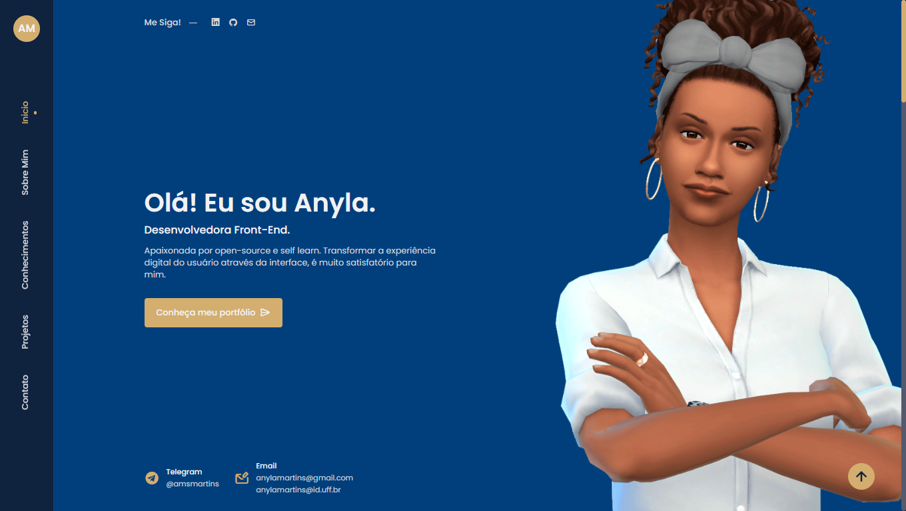
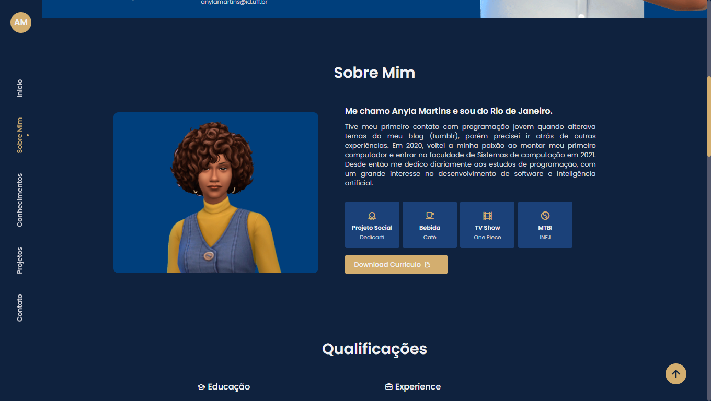
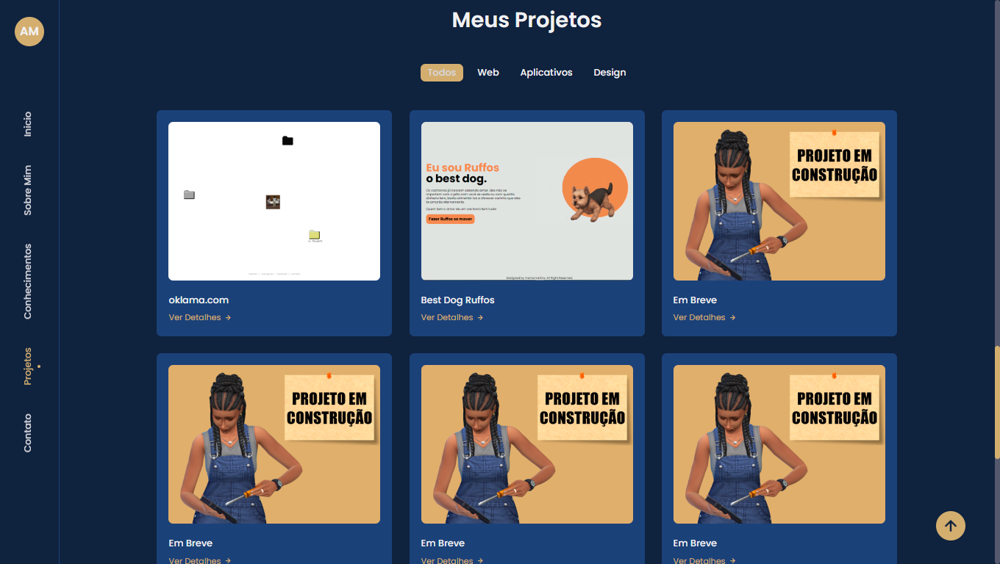

# Portfolio Pessoal
- 🖱️ [Clique aqui](https://amsmartins.github.io) para acessar o site.

## Demonstação da Página
#### Página Inicial



#### Sobre Mim



#### Projetos


⭐ Deixe uma Star, por favor. Vai me ajudar muito.

## 🗂 Seções
* Inicio
* Sobre Mim
* Qualificações
* Conhecimentos
* Projejos
* Contato

## 🛠 Ferramentas Usadas:
```
- GitHub Pages - Para hospedar a website
- HTML
- CSS
- JavaScript
```


## Observações
✔ Responsivo


## Contribuições
São bem-vindos:  
- 🍴 Forks
- 👯 Clone na sua máquina local.
- 🔃 Pull request.
<br>
Para grandes mudanças, por favor, abra primeiro uma issue discutir o que gostaria de mudar.


<hr>
<div align="center">
<a href="https://github.com/amsmartins">

</a> 
</div>	
<h4 align="center">
   Feito com 💙 by <a href="https://www.linkedin.com/in/amsmartins/" target="_blank">Anyla Martins</a>
</h4>


## License
- **[MIT license](http://opensource.org/licenses/mit-license.php)**
